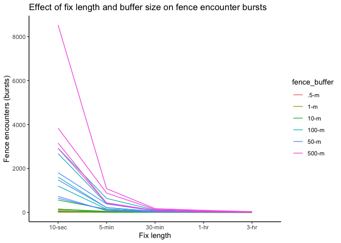
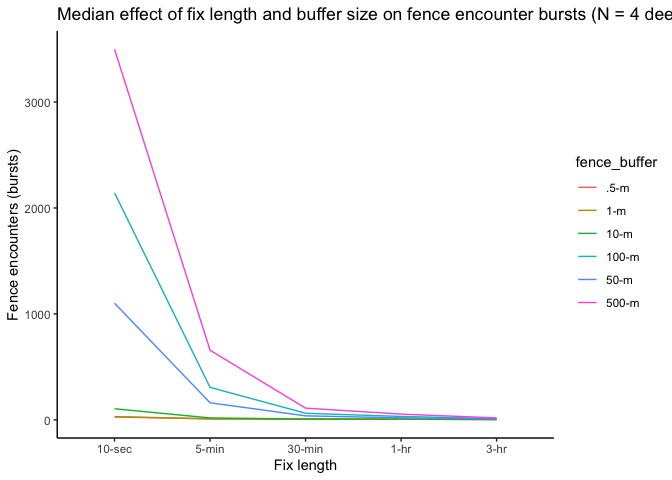
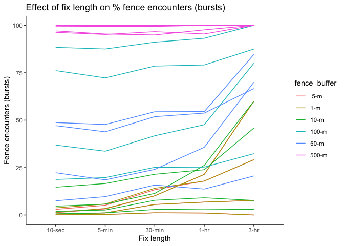
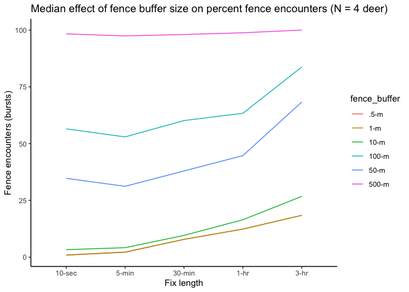
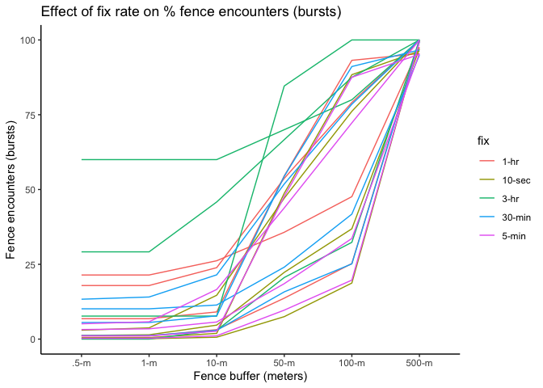
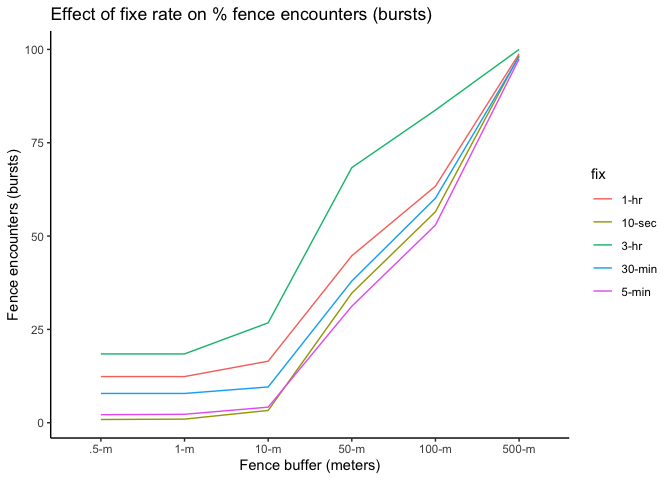

How buffer size and igotu fix length influence behavior analysis
================
Amy Van Scoyoc
5/20/2020

``` r
knitr::opts_chunk$set(message = F, warning = F)
```

\#Load Packages

``` r
#load packages
library(tidyverse)
library(plyr)
library(readr)
library(amt)
library(survival)
```

\#Import

First, I import the raw igotu data for all animals, combine the .csvs,
and add a column for the animal ID based on the file name. I then format
the timestamps and nest the data by ID so that we can create a track for
each animal using the `amt` package.

``` r
#set working directory
setwd("raw_data")
#set options to prevent truncated lat/long
options(digits=15)
#get file names
files <- list.files()
#read in files
data <- purrr::map_df(files, function(x) {
                        data <- read_csv(x) %>% select(1:4)
                        cbind(ID = substr(x,1,2), data)
}) %>% #create timestamp
  mutate(timestamp = as.POSIXct(paste(Date, Time), format = "%Y-%m-%d %H:%M:%S", tz = "America/Los_Angeles")) %>% 
  nest(-ID) #nest the data by animal ID
```

Next, we create a track for each individual animal using the `amt`
package and transform the coordinates to UTMs so that it is easier to
work with.

``` r
#make "track" for each ID using amt package
igotu <- data %>% 
  mutate(trk = map(data, function(d){
    mk_track(d, Longitude, Latitude, timestamp, crs = CRS("+init=epsg:4326")) %>% 
      # Transform latlongs into UTMs
      transform_coords(CRS("+proj=utm +zone=10 +datum=WGS84 +units=m +no_defs +ellps=WGS84 +towgs84=0,0,0"))
  }))
```

\#Resampling

In order to measure the impact of fix rate on fence crossing analyses,
we have to resample the animal tracks to various intervals.

First, I check the sampling rate of the raw data, just to see what we
are working with.

``` r
#check sampling rate
igotu %>%
  mutate(sr = lapply(trk, summarize_sampling_rate)) %>% 
  dplyr::select(ID, sr) %>% unnest
```

    ## # A tibble: 4 x 10
    ##   ID    min     q1      median mean        q3     max       sd      n unit 
    ##   <chr> <table> <table> <tabl> <table>     <tabl> <tabl> <dbl>  <int> <chr>
    ## 1 A1    4        5       5      5.1221292…  5       40   0.763 121658 sec  
    ## 2 A2    9       10      10     10.1476470… 10      189   0.943 123592 sec  
    ## 3 B2    3        5       5      5.1944409…  5      311   3.00  119013 sec  
    ## 4 E4    8        9      10      9.7686210… 10     3610   9.20  155818 sec

Next, I write a function to classify animal tracks into bursts,
eliminating bursts with fewer than 2 points. I run this function with
various intervals to create data frames with bursts of different fix
rates. \*Note that this function uses `seconds()` as the rate, so
multiply by 60 to convert to minutes and again by 60 to convert to
hours.

``` r
#resample function for multiple intervals (in seconds)
resample <- function(df, rate){
            steps <- df %>% 
                mutate(step = map(df[[3]],function(x){
                              x %>% 
                              # Eliminate steps longer than 3 hours
                              track_resample(rate = seconds(rate), tolerance = seconds(1)) %>%
                              # Eliminate bursts with fewer than 2 points
                              filter_min_n_burst(min_n = 2)}))
            return(steps)
}
#apply resample function
ten_sec <- resample(igotu,10)
five_min <- resample(igotu,5*60)
thirty_min <- resample(igotu,30*60)
one_hr <- resample(igotu,1*60*60)
three_hr <- resample(igotu,3*60*60)
three_hr[[4]]
```

    ## [[1]]
    ## # A tibble: 54 x 4
    ##         x_       y_ t_                  burst_
    ##  *   <dbl>    <dbl> <dttm>               <dbl>
    ##  1 489065. 4312100. 2017-02-14 00:08:27      1
    ##  2 489104. 4312124. 2017-02-14 03:08:28      1
    ##  3 489100. 4312115. 2017-02-14 06:08:27      1
    ##  4 491530. 4320139. 2017-02-14 09:08:28      1
    ##  5 491534. 4320144. 2017-02-14 12:08:27      1
    ##  6 491524. 4320124. 2017-02-14 15:08:26      1
    ##  7 491547. 4320143. 2017-02-14 18:08:27      1
    ##  8 491547. 4320054. 2017-02-14 21:08:28      1
    ##  9 491553. 4320064. 2017-02-15 00:08:30      2
    ## 10 491535. 4320064. 2017-02-15 03:08:30      2
    ## # … with 44 more rows
    ## 
    ## [[2]]
    ## # A tibble: 54 x 4
    ##         x_       y_ t_                  burst_
    ##  *   <dbl>    <dbl> <dttm>               <dbl>
    ##  1 492602. 4317001. 2017-07-04 22:06:59      1
    ##  2 492596. 4317010. 2017-07-05 01:06:59      1
    ##  3 492594. 4317009. 2017-07-05 04:06:59      1
    ##  4 491748. 4320082. 2017-07-05 13:07:08      4
    ##  5 491736. 4320060. 2017-07-05 16:07:07      4
    ##  6 491739. 4320061. 2017-07-05 19:07:06      4
    ##  7 491691. 4319781. 2017-07-06 07:07:31      8
    ##  8 491675. 4319731. 2017-07-06 10:07:31      8
    ##  9 491682. 4319726. 2017-07-06 13:07:31      8
    ## 10 491494. 4319788. 2017-07-07 04:07:55     13
    ## # … with 44 more rows
    ## 
    ## [[3]]
    ## # A tibble: 52 x 4
    ##         x_       y_ t_                  burst_
    ##  *   <dbl>    <dbl> <dttm>               <dbl>
    ##  1 489102. 4312121. 2017-02-14 06:11:02      3
    ##  2 493555. 4317548. 2017-02-14 09:11:01      3
    ##  3 493743. 4317178. 2017-02-14 12:11:03      4
    ##  4 493608. 4317623. 2017-02-14 15:11:03      4
    ##  5 493613. 4317619. 2017-02-14 18:11:04      4
    ##  6 493819. 4318369. 2017-02-14 21:11:05      4
    ##  7 494029. 4318799. 2017-02-15 00:11:06      4
    ##  8 494029. 4318802. 2017-02-15 03:11:06      4
    ##  9 494167. 4318753. 2017-02-15 09:11:11      6
    ## 10 494192. 4318750. 2017-02-15 12:11:11      6
    ## # … with 42 more rows
    ## 
    ## [[4]]
    ## # A tibble: 80 x 4
    ##         x_       y_ t_                  burst_
    ##  *   <dbl>    <dbl> <dttm>               <dbl>
    ##  1 494362. 4319748. 2017-11-01 19:13:17      5
    ##  2 494578. 4319958. 2017-11-01 22:13:18      5
    ##  3 494505. 4319793. 2017-11-03 04:14:23     15
    ##  4 494465. 4320000. 2017-11-03 07:14:23     15
    ##  5 494434. 4320063. 2017-11-03 13:14:33     17
    ##  6 494481. 4319994. 2017-11-03 16:14:33     17
    ##  7 494366. 4319982. 2017-11-03 19:14:41     18
    ##  8 494337. 4319961. 2017-11-03 22:14:42     18
    ##  9 494522. 4319701. 2017-11-04 01:14:42     18
    ## 10 494518. 4319878. 2017-11-04 19:15:15     24
    ## # … with 70 more rows

``` r
#combine dfs into single list for interation later
frames <- list(ten_sec,five_min,thirty_min,one_hr,three_hr)
```

\#Fences

Here, I load in fence shapefiles of HREC using the `sf` package. I
specify fence buffer sizes I want to test and transform the crs into
UTMs to match the animal data.

``` r
library(sf)

#read in fence shapefile
fences <- st_read("fences/Fences_103015.shp")
```

    ## Reading layer `Fences_103015' from data source `/Users/Amy/Documents/Berkeley Classes/Brashares Lab/projects/igotu/fences/Fences_103015.shp' using driver `ESRI Shapefile'
    ## Simple feature collection with 235 features and 8 fields
    ## geometry type:  LINESTRING
    ## dimension:      XY
    ## bbox:           xmin: -268477.847100002 ymin: 111634.296099999 xmax: -263888.244600001 ymax: 118410.474099999
    ## epsg (SRID):    3310
    ## proj4string:    +proj=aea +lat_1=34 +lat_2=40.5 +lat_0=0 +lon_0=-120 +x_0=0 +y_0=-4000000 +ellps=GRS80 +towgs84=0,0,0,0,0,0,0 +units=m +no_defs

``` r
#set crs 
crs = "+proj=utm +zone=10 +datum=WGS84 +units=m +no_defs"
#adjust buffer distances 
fence_buff_500m <- st_buffer(fences, 500) %>% st_transform(crs = st_crs(crs))
fence_buff_100m <- st_buffer(fences, 100) %>% st_transform(crs = st_crs(crs))
fence_buff_50m <- st_buffer(fences, 50) %>% st_transform(crs = st_crs(crs))
fence_buff_10m <- st_buffer(fences, 10) %>% st_transform(crs = st_crs(crs))
fence_buff_1m <- st_buffer(fences, 1) %>% st_transform(crs = st_crs(crs))
fence_buff_.5m <- st_buffer(fences, 0.5) %>% st_transform(crs = st_crs(crs))
```

\#Fence Encounters

To measure whether an animal crosses a fence, I create a function that
counts the number of bursts that intersect a fence buffer.

``` r
#create encounter function
encounters <- function(x, crs, layer){
  temp <- map(x$step, function(y){
                                y %>% 
                                  st_as_sf(coords = c("x_", "y_")) %>% 
                                  group_by(burst_) %>% 
                                  summarize(do_union = FALSE) %>% 
                                  st_cast("LINESTRING") %>% 
                                  st_set_crs(crs) %>% 
                                  st_intersects(layer) %>% 
                                  map(length) %>% 
                                  subset(. != 0) %>% 
                                  length()}) %>% 
          unlist() %>% 
          `names<-`(as.character(quote(x))) %>% 
          as_tibble()
  return(temp)
}
```

I apply this function to all animals frames, with each combination of
fix rate and buffer size.

``` r
#set new inits
fixes <- c("10-sec","5-min", "30-min", "1-hr", "3-hr") %>% rep(each=4)
animal_IDs <- igotu[[1]]

#run encounter function
cross <- list("500-m" = map_dfr(frames, encounters, crs, fence_buff_500m),
              "100-m" = map_dfr(frames, encounters, crs, fence_buff_100m),
              "50-m" = map_dfr(frames, encounters, crs, fence_buff_50m), 
              "10-m" = map_dfr(frames, encounters, crs, fence_buff_10m), 
              "1-m" = map_dfr(frames, encounters, crs, fence_buff_1m),
              ".5-m" = map_dfr(frames, encounters, crs, fence_buff_.5m)) %>% 
              bind_rows(.id="buffers") %>% 
              cbind(ID = animal_IDs,fixes = fixes,.)
```

To ensure that we compare the proportion of fence crossings at each fix
rate (i.e. higher fix rates have higher numbers of bursts, so the
numbers are somewhat misleading to compare), I create a function to
total the number of bursts for each animal ID at each fix rate. I bind
this to our data frame and use it to calculate the proportion of
crossings.

``` r
#calculate total # of steps (i.e. bursts) per track
totals <- function(x){
      t <- map(x$step, function(y){
                  y %>% 
                  group_by(burst_) %>% 
                  tally() %>%
                  nrow()}) %>% 
      unlist() %>% 
      `names<-`(as.character(quote(x))) %>% 
      as_tibble()
  return(t)
}

t <- list("totals" = map_dfr(frames, totals)) %>% 
  bind_rows() %>%
  cbind(id=paste0(animal_IDs,fixes),ID=animal_IDs, fixes=fixes,.) %>% 
  select(id=id,total_bursts=4)
     
n_cross <- cross %>% 
  mutate(id=paste0(ID,fixes)) %>% 
  left_join(.,t,by="id") %>% 
  mutate(percent_cross = value/total_bursts*100) %>% 
  `names<-`(c("ID", "fix", "fence_buffer","cross_bursts","id","total_bursts","percent_cross"))
```

\#Plotting

Here are the results\!
<!-- -->

<!-- -->

<!-- -->

<!-- -->

<!-- -->

<!-- -->

This looks great, now I just need to filter the igotu data so that the
fixes are only on the deer after release (some pre-data from HREC and
stuff is there which influences encounter rates in the bursts). See
igotu\_exploratory.rmd
